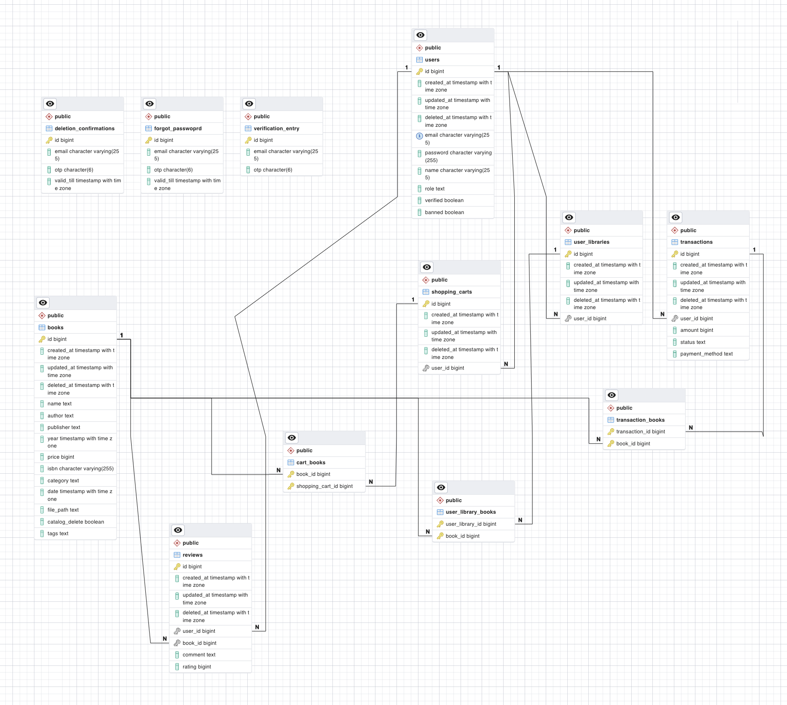

[](https://classroom.github.com/a/LECuYE4o)

# Deployed Links
- API baseurl: http://bookstore.anrdhmshr.tech/api/v1
- Health Check: http://bookstore.anrdhmshr.tech/api/health
- API Docs: https://documenter.getpostman.com/view/19697822/2s9Y5Wxifq

**Test Credentials** to access Deployed Api (you can make your own account as well — will need a valid email):
```
{
    "email": "testuser@anrdhmshr.com",
    "password": "Testpwd@111"
}
```
# Table of Contents
- [Deployed Links](#deployed-links)
- [Table of Contents](#table-of-contents)
- [How to run locally](#how-to-run-locally)
- [Features](#features)
    - [1. Auth/User:](#1-authuser)
    - [2. Access Control:](#2-access-control)
    - [3. Secure Password Reset Flow:](#3-secure-password-reset-flow)
    - [4. Forgot Password.](#4-forgot-password)
    - [6. Account Deletion:](#6-account-deletion)
    - [7. Admin:](#7-admin)
    - [8. SuperAdmin:](#8-superadmin)
    - [9. Books Catalog:](#9-books-catalog)
    - [10. Shopping Cart:](#10-shopping-cart)
    - [13. Credits](#13-credits)
    - [12. User Library:](#12-user-library)
    - [13. Reviews:](#13-reviews)
    - [14. Logging with Retention (Rotating Log)](#14-logging-with-retention-rotating-log)
    - [15. Reverse Proxy on prod using nginx.](#15-reverse-proxy-on-prod-using-nginx)
    - [16. Security](#16-security)
- [Recommendation Engine](#recommendation-engine)
    - [Rough flow for giving users recommendations:](#rough-flow-for-giving-users-recommendations)
    - [Caveats](#caveats)
- [Where I ran into issues (aka, Gorm):](#where-i-ran-into-issues-aka-gorm)
- [Project Structure](#project-structure)
  - [Explanation](#explanation)
  - [ERD](#erd)
# How to run locally
1. Clone the repo.
2. Make sure you have docker/docker desktop installed, and a docker daemon running.
3. Rename `sample.env` to `.env`, and set JWT signing secret (API_SECRET) with `openssl rand -hex 32`.
4. For MAILTRAP_API_TOKEN, obtain a free api token from https://mailtrap.io/, or run the app without it (confirmation mails, etc, will not be sent in that case).
5. `make dev`
6. App will be served at http://0.0.0.0:8000/ by default. Check http://0.0.0.0:8000/health to see if everything is OK on serverside.
7. PG Admin will be served at http://0.0.0.0:5050/browser (only in development). Hostname: `postgres_db`, Username and Password as in your env config.
8. API Docs at: https://documenter.getpostman.com/view/19697822/2s9Y5Wxifq
   
# Features
### 1. Auth/User: 
JWT Auth. Role Based (Base User and Admin) access to resources. Hashed Password. Password Strength Check. After implementing my registration controllers I realised that a more secure way to do it would have been by asking users to first specify an email, confirm that email, and then ask them to set a password. This would guard against user enumeration attacks. Right now, I'm guarding against it by essentially lying — I say that the confirmation email got sent if you try making an account with an existing email. This could be confusing, however, if the user has genuinely forgotten if they had an account associated with a particular email or not. Alternatively, I could send a warning email in such cases.
### 2. Access Control:
There is router auth middleware which handles access for the 3 user types: base, admin and superadmin.
### 3. Secure Password Reset Flow:
Require current and new password. On change, mail email associated with user about the change ("If this was not you, we request you to change your password via the Email-based forgot password option"). On failure to reset password due to incorrect current password, mail associated email about attempt (in case it was a malicious use trying to transfer ownership).
### 4. Forgot Password.
An OTP is sent to the registered email acount, and is valid for 3 minutes.
```
From: BOOKSTORE ADMIN test@anrdhmshr.tech Subject: Forgot Password.
Date: 28 August 2023 at 15:57
To: Anirudh Gray anirudhgray@gmail.com
A forgot password request was made for the email associated with your account. If this was not you, feel free to ignore this email. Otherwise, click on this link to post your new password: http://0.0.0.0:8000/v1/auth/set-forgotten-password? email=anirudh04mishra@gmail.com&otp=255610 . This link will be active for 3 minutes.
```
### 6. Account Deletion:
The user's profile is no longer accessible. User can request an account deletion, and will then recieve a confirmation email, with an OTP and a link to complete the process. The process must be completed within a set amount of time (3 minutes).
### 7. Admin:
Admin users can add books to the catalog, as well as edit their details. In addition, they can delete reviews and books. They can also ban users (essentially, deactivate plus ban boolean). Deleting books should ordinarily NOT remove it from libraries of users who have already purchased it.
### 8. SuperAdmin:
By default, if there are no admins in the database, the next user who signs up is set as the SuperAdmin (ie, intended to be used when deploying the applicatiod in prod for the first time). SuperAdmin can perform all normal admin functions, with the added permission of promoting base users to Admin, and vice verse.
### 9. Books Catalog:
Users can fuzzy search entire books catalog for title, author and/or category. They can filter by category, and sort by price.
### 10. Shopping Cart:
Users can add any book not already purchased by them to their chopping cart. They can remove books from their cart as well. On checking out their cart, they "buy" all books in the cart, and those books get added to their library of bought books. A transaction record is created for admin audit purposes. The cart gets cleared of all books on a successful transaction.
### 13. Credits
Users need credits to buy books. They can purchase credits (a transaction record is created for this as well).
### 12. User Library:
Library of books bought by a user. The user can download any of them as many times as they want.
### 13. Reviews:
Users can only review a book that they have bought (ie, which is in their library). Reviews have a comment, and a rating (which is used to calc avg rating for the book, and for generating recommendations).
### 14. Logging with Retention (Rotating Log)
Currently logging to a local rotating logfile. Logs are persisted on prod by mounting a docker volume for them (app_logs). To access (will copy logs to ./logs dir on host system):
`docker cp <SERVER_CONTAINER_ID>:/app_logs ./logs`
### 15. Reverse Proxy on prod using nginx.
### 16. Security
I am protecting against attacks like SQLI, and dependency graph revealed no major vulnerabilities with known exploits.
# Recommendation Engine
> **Note**: If you're trying this out with a new user, note that you will not get any recommendations. Review a few books, and then you'll be able to get recommendations — this is because of the "cold start" issue in my implementation (explained below).

I have implemented a simple collaborative filtering based recommendations engine. Ref: https://www.toptal.com/algorithms/predicting-likes-inside-a-simple-recommendation-engine.

Implementation at: [Recommender Controller](/controllers/recommendations.controller.go) and [Recommender Utils](/utils/recommender/recommender.go)

The general idea is that we will not care about the specific attributes of books, and then use some sort of ML Algorithm to figure out what kind of books our user will like (using the user's existing library, reviews, etc etc). Instead, our system will look **similarities** between users.

We keep a record of each user's likes and dislikes (let's base this on review rating — maybe 4 or 5 is "like", everything else is "dislike"). These are two sets that exist for every user. We're going to use something called the [Jaccard Coefficient](https://en.wikipedia.org/wiki/Jaccard_index) to calculate how similar two such sets are. For example, two duplicate sets will be completely similar (coeff of 1) while two sets with nothing in common will have a coeff of 0 (no similarity or overlap between the sets).

```J(A, B) = |A ∩ B| / |A ∪ B|```

### Rough flow for giving users recommendations:
1. Find user's current likes and dislikes.
2. Get all users who have interacted with those items (both liked and unliked).
3. For each of those users, calculate their similarity to our current user using the Jaccard Coefficient. (modified, on a -1 to +1 scale)
4. Get a set of items the current user has not yet liked/disliked.
5. For each of those items, calculate the probability that it should be recommended to the current user. How do we do this:
   1. Result = Numerator / Denominator
   2. Get other users who liked or disliked that item.
   3. Numerator is the sum of the similarity indices of all these users who liked it - sum of indices of users who disliked it.
   4. Denominator is simply the total number of users of liked or disliked the item.
6. Now we can rank the items based on this calculated probability, and give X number of recommendations.
### Caveats
- Currently doing calculation in-memory. Like, user wants reccs => I do all of the above and return some reccs. Maybe a better way to handle this would be to use something like Redis which apparently has nice features to work with sets, and generate reccs periodically. 
- Also, a major issue with collaborative filtering is that of "cold start" — since this method relies on other similar users, what do you do for the first few users? And you can't get any recommendations until you make a few likes/dislikes of your own, and books with no reviews cannot be recommended to any users. In such cases a hybrid approach involving this + a content based engine would be helpful.
- I am currently doing a basic like/dislike thing. However, since my ratings are on a scale of 1-5 I should make use of that (by giving more weight to a 5 than a 4, instead of treating both as equal likes).
# Where I ran into issues (aka, Gorm):
- Did not initially realise that gorm's auto-migrations do not, in fact, drop unused columns. While it does make sense as a default so that we don't lose data... well, anyway, spent some time trying to debug why my many2many join table had an unrelated column in it. Ended up dropping the table and then running migrations, will make sure to use my own migration scripts or a more full fledged library like goose.
- Needed to enter associations mode to delete properly, otherwise only the reference would be yeeted.
- The whole flow of user deletion. The culprit? Gorm, yet again.
- Overall, gorm seems like a pain. Unfortunately, I also made the poor design choice of having my data layer logic in my business logic controllers — using a "repository pattern" would have made it easier to switch out to something else. Maybe a sql query builder like Squirrel instead of an ORM.
# Project Structure
```
.
├── Dockerfile
├── Dockerfile-dev
├── Makefile
├── README.md
├── config
│   ├── config.go
│   ├── db.go
│   └── server.go
├── controllers
│   ├── admin.controller.go
│   ├── auth.controller.go
│   ├── books.controller.go
│   ├── cart.controller.go
│   ├── checkout.controller.go
│   ├── recommendations.controller.go
│   ├── review.controller.go
│   └── user.controller.go
├── docker-compose-dev.yml
├── docker-compose.yml
├── docs
│   ├── docs.go
│   ├── swagger.json
│   └── swagger.yaml
├── erd.png
├── go.mod
├── go.sum
├── infra
│   ├── database
│   │   └── database.go
│   └── logger
│       └── logger.go
├── main.go
├── migrations
│   └── migration.go
├── models
│   ├── book.model.go
│   ├── cart.model.go
│   ├── deletion_confirmation.model.go
│   ├── forgot_password.model.go
│   ├── review.model.go
│   ├── transaction.model.go
│   ├── user.model.go
│   ├── user_library.model.go
│   └── verification.model.go
├── nginx
│   ├── Dockerfile
│   └── nginx.conf
├── routers
│   ├── index.go
│   ├── middleware
│   │   ├── auth.middleware.go
│   │   └── cors.go
│   └── router.go
└── utils
    ├── auth
    │   ├── auth.go
    │   └── auth_test.go
    ├── email
    │   └── email.go
    ├── recommender
    │   ├── recommender.go
    │   └── recommender_test.go
    └── token
        └── token.go
```
## Explanation
- `models/`: The model structs for each table in my DB, along with their relations.
- `controllers/`: Combined handlers for each route, along with controllers for the business logic, as well as data accessing repository functions.
- `routers/`: API routes and auth+cors middleware.
- `utils/`: Reusable utility functions for business logic in controllers. Eg, for mailing, password validation, the recommender system etc.
- `config/`: Initial reading in config from .env, setting up server and DB configurations.
## ERD
> **Note:** This does not show 1:1 relations properly (shown as 1:N). Will update.


